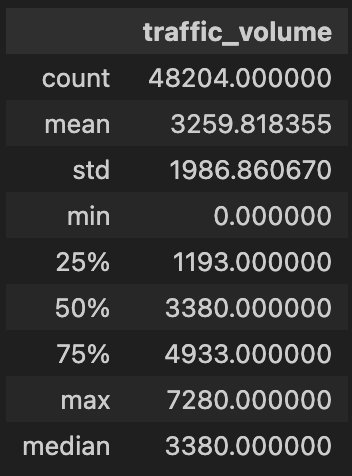
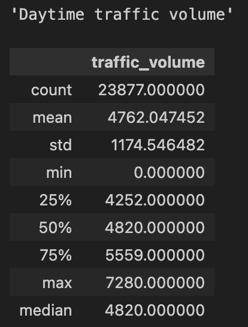
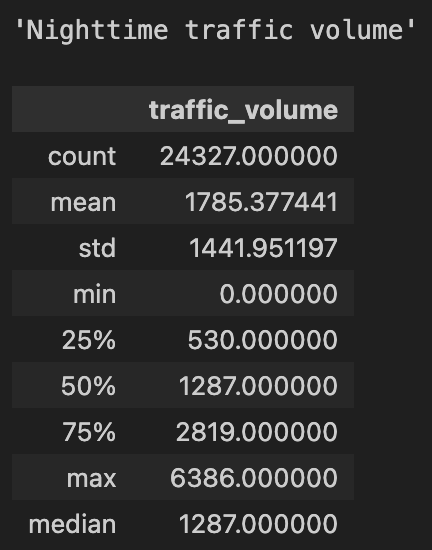
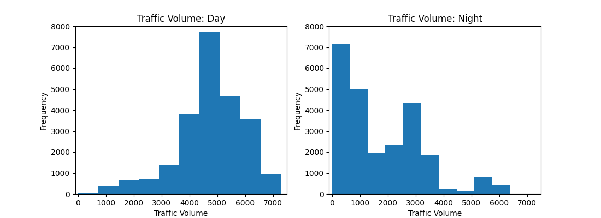

# IDS-706-Data-Engineering

# Mini Project #9: Cloud Hosted Jupyter Notebook - Google Colab

The purpose of this project was to host a jupyter notebook on a cloud service such as Google Colab. The notebook hosted in Google-Colab is called `heavy_traffic_indicators.ipynb`. The subject and results of the notebook used aren't very important for this project. Instead the focus is to show how easily a cloud service can be integrated with Github. 

If you wish to know more about the data and results of `heavy_traffic_indicators.ipynb` continue to read the `README`or review the notebook itself. 

Additionally, the `README`covers details on `main.py` and `test_main.py` which are scripts that perform the same actions as the cloud-hosted notebook which are needed for CI/CD. 

## Resource for Implementing Google-Colab
This project was based on the instructions provided by this [Pragmatic AI Labs video](https://www.youtube.com/watch?v=6Egd-OMLLV4)

### About the Data
The data used is provided by John Hogue and can be found on the [UCI Machine Learning Repository](https://archive.ics.uci.edu/dataset/492/metro+interstate+traffic+volume)

The dataset contains the hourly traffic volume for MN DoT ATR station 301 located between Minneapolis and St Paul, MN. The dataset contains features pertaining to holidays and weather in addition to the traffic volume. 

### Functions
Main.py contains four functions:
1. read_csv_file -- Takes in a .csv file name (as a string) and use Pandas to read the file into a dataframe

2. stats_overview -- Takes a dataframe and column of interest and produces a dataframe with the following information: count, mean, standard deviation (std), minimum value (min), maximum value(max), lower percentile (25), 50th percentile (50), upper percentile (75), and median. NOTE: the median and 50th percentile are the same.

3. split_day_night -- takes a dataframe and splits in into two dataframes based on the date_time value. The daytime dataframe contains information from 7am to 6:59:59 pm. The nighttime dataframe contains information from 7pm to 6:59:59 am.

4. hist_day_night -- takes in the daytime and nighttime dataframes and creates a side-by-side histogram of the traffic volume.

### Summary Statistics

Traffic Volume Summary Statistics Overview:

<!-- {: width="200"} -->

Traffic Volume Summary Statistics (Day vs Night):

<!-- {: width="200"}  
{: width="200"} -->

### Data Visualization

## Conclusion

The distribution of the traffic volume during the day is left skewed; indicating that most of traffic volume values are high. The distribution of the nighttime data is right skewed; indicating mostly low traffic volume values. 

Further analysis of this dataset could be performed to help find indicators of heavy traffic. Since traffic volumes are low in the evening, it would be reasonable to only analyze the daytime data.

Possible features to explore further are:
- Time indicators: Year, Month, Day, Hour
- Weather indicators

  
